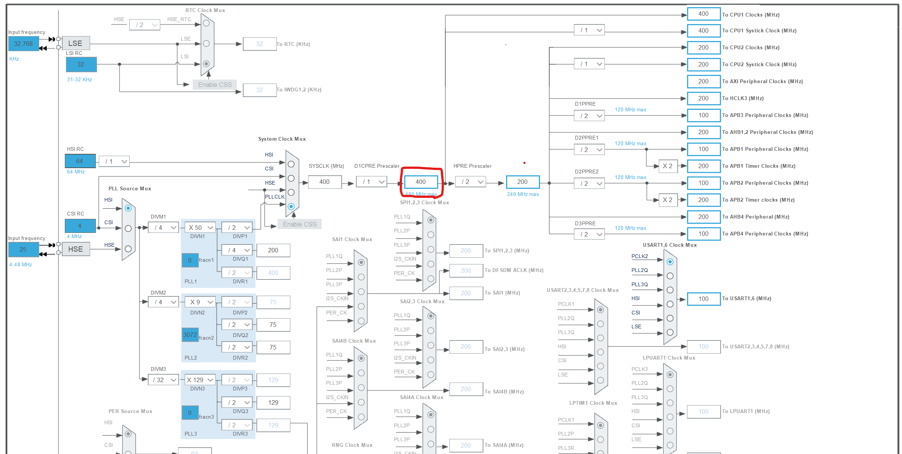
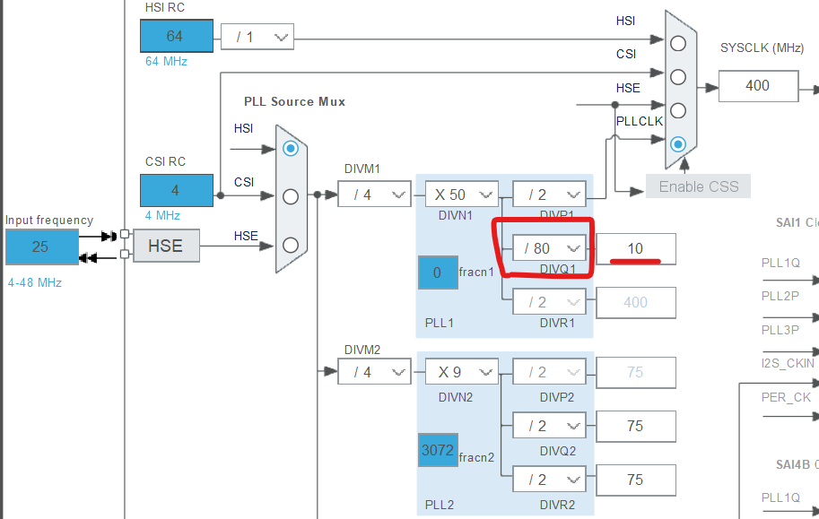
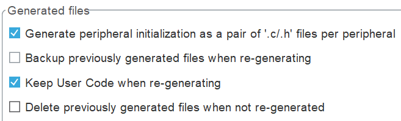
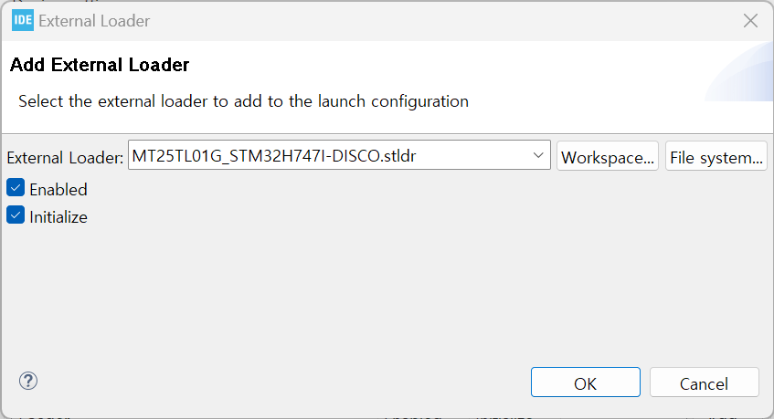
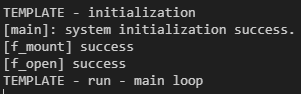

# 01. How to create a new STM32 project.
0. Open STM32CubeIDE
1. File -> New -> STM32 Project
2. Board Selector -> STM32H747I-DISCO -> Next
3. Fill below
>   Project Name: Anything you want   
>   Targeted Language:  C++   
4. Finish
5. Initilize all peripherals with their default Mode -> **No**

# 02. How to configure periperals (.ioc).
0. Open .ioc
1. Pinout & Configuration
> 1. Pinout -> Clear Pinouts -> Tes   
> 2. USART Configuration
> > * PA9 -> USART1_TX   
> > * PA10 -> USART1_RX
> > * Connectivity -> USART1(M7) check -> Mode(Asynchronous)
> 3. Uncheck unused configurations
> > * Analog -> Uncheck ADC1(M4)
> > * Timers -> Uncheck TIM3(M4)
> > * Multimedia -> Unchcek DCMI(M4)
> 4. SDMMC Configuration
> > * Connectivity -> SDMMC1(M7) check -> Mode(SD 4 bits Wide bus)
> > * * NVIC Settings -> ***SDMMC1 global interrupt Enable*** 
> > * * GPIO Settings -> Configure all the GPIO pins to Pull-up mode. (***Do not modify other settings in GPIO Settings tap***)
> > * Middleware and Software Packs -> FATFS_M7 -> SD Card check
> > * * Platform Settings -> Found Solutions -> PI8
> > * * Set Defines -> USE_LFN, FS_EXFAT check.
> > * * Advanced Settings -> Use dma template -> ***Disabled***
> 5. X-CUBE-AI Configuration
> > * Application -> ApplicationTemplate -> OK
> > * * Add model.onnx
> > * * Click gear icon
> > * * * In **Options** tap, check **Input/Output data are channel last**
> > * * * In **External Ram** tap, check **Use external RAM** and **Use activation buffer** 
> > * * * In **External Flash** tap, check **Use external flash**, and select **Split weights between internal and external flash using a linker script** rather than **Generate a separated bin file for weights** -> Click Propose placement. -> OK (This automatically analyze the given model.)
> > * * Click **Validate on decktop**
2. Clock Configuration
> 1. Make below clock to 400 MHz
> **Fig 1.** SYSCLK configuration. This makes the core faster.</img>
> 2. Configure the DIVQ1 to / 80 (This makes the clock for SDMMC1 10 MHz)
> **Fig 2.** DIVQ1 configuration. This let the SDMMC work without DMA configuration.</img>   
> **Make sure that SYSCLK:400 MHz and SDMMC1 50 Mhz (below is OK but doooooo not exceed them)**
3. Project Manager
> 1. Code Generator configuration:
> > **Fig 3.** Code Generator. **Check** **Generate peripheral intialization as a pair of '.c/.h' files per peripheral**, and **uncheck** **Delete prebiously generated files when not re-generated**.</img>
4. Save and generate code.

# 03. How to upload CM4 code and CM7 code.
1. CM4
> 1. Open ~~~_CM4 -> Core -> Src -> main.c
> 2. Click ***Run*** -> ***Run***
> 3. Click ***Debugger*** tap -> Check ***ST-LINK S/N*** -> Click ***Scan*** button -> Apply and OK
2. CM7
> 1. Open ~~~_CM7 -> Core -> Src -> main.c
> 2. Click ***Run*** -> ***Run***
> 3. Click ***Debugger*** tap -> Check ***ST-Link S/N*** -> Click ***Scan*** button.
> 4. In ***External loaders*** section, click ***Add...*** button -> Look for ***MT25TL01G_STM32H747I-DISCO.stldr*** -> Check ***Initialize***.
> **Fig 4.** External Loader configuration</img>
> 5. Apply and OK

# 04. How to write basic CM7 user codes.
1. Add below includes in ***USER CODE BEGIN Includes*** section.
```C
#include <stdio.h>
```
2. Add below **_write** function in ***USER CODE BEGIN 0*** section.
```C
int _write(int fd, char *ptr, int len)
{
	HAL_UART_Transmit(&huart1, (unsigned char*)ptr, len, HAL_MAX_DELAY);
	return len;
}
```
3. Add below **check_fatfs_error** prototype in ***USER CODE BEGIN PFP*** section
```C
FRESULT check_fatfs_error(char *op, FRESULT res);
```
4. Add below **printf** and **check_fatfs_error** functions in ***USER CODE BEGIN 2*** section.
```C
printf("[%s]: system initialization success.\r\n", __func__);
check_fatfs_error("f_mount", f_mount(&SDFatFS, SDPath, 0));
check_fatfs_error("f_open", f_open(&SDFile, "X_train.txt", FA_READ));
```

5. Add below **check_fat_fs_error** function definition in ***USER CODE BEGIN 4*** section.
```C
FRESULT check_fatfs_error(char *op, FRESULT res) {
	switch (res) {
	case FR_OK:
		printf("[%s] success\r\n", op);
		break;
	case FR_DISK_ERR:
		printf("[%s] error: FR_DISK_ERR\r\n", op);
		break;
	case FR_INT_ERR:
		printf("[%s] error: FR_INT_ERR\r\n", op);
		break;
	case FR_NOT_READY:
		printf("[%s] error: FR_NOT_READY\r\n", op);
		break;
	case FR_NO_FILE:
		printf("[%s] error: FR_NO_FILE\r\n", op);
		break;
	case FR_NO_PATH:
		printf("[%s] error: FR_NO_PATH\r\n", op);
		break;
	case FR_INVALID_NAME:
		printf("[%s] error: FR_INVALID_NAME\r\n", op);
		break;
	case FR_DENIED:
		printf("[%s] error: FR_DENIED\r\n", op);
		break;
	case FR_EXIST:
		printf("[%s] error: FR_EXIST\r\n", op);
		break;
	case FR_INVALID_OBJECT:
		printf("[%s] error: FR_INVALID_OBJECT\r\n", op);
		break;
	case FR_WRITE_PROTECTED:
		printf("[%s] error: FR_WRITE_PROTECTED\r\n", op);
		break;
	case FR_INVALID_DRIVE:
		printf("[%s] error: FR_INVALID_DRIVE\r\n", op);
		break;
	case FR_NOT_ENABLED:
		printf("[%s] error: FR_NOT_ENABLED\r\n", op);
		break;
	case FR_NO_FILESYSTEM:
		printf("[%s] error: FR_NO_FILESYSTEM\r\n", op);
		break;
	case FR_MKFS_ABORTED:
		printf("[%s] error: FR_MKFS_ABORTED\r\n", op);
		break;
	case FR_TIMEOUT:
		printf("[%s] error: FR_TIMEOUT\r\n", op);
		break;
	case FR_LOCKED:
		printf("[%s] error: FR_LOCKED\r\n", op);
		break;
	case FR_NOT_ENOUGH_CORE:
		printf("[%s] error: FR_NOT_ENOUGH_CORE\r\n", op);
		break;
	case FR_TOO_MANY_OPEN_FILES:
		printf("[%s] error: FR_TOO_MANY_OPEN_FILES\r\n", op);
		break;
	case FR_INVALID_PARAMETER:
		printf("[%s] error: FR_INVALID_PARAMETER\r\n", op);
		break;
	default:
		printf("[%s] Unknown error\r\n", op);
		break;
	}
	return res;
}
```
6. Upload CM7 code (see *03. How to upload CM4 code and CM7 code.*), and check serial monitor.
**Fig 5.** Serial Terminal</img>
